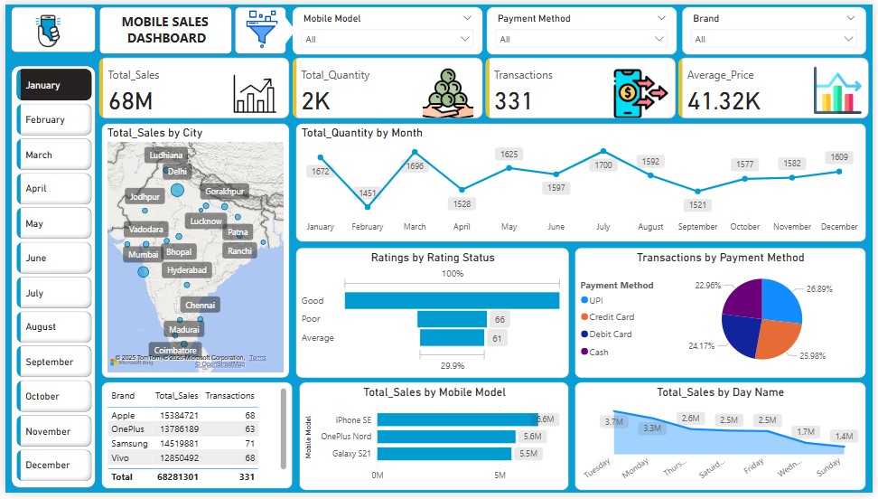

# 📊 Mobile Sales Dashboard - Power BI Project

## Project Overview

The Mobile Sales Dashboard is an interactive Power BI dashboard designed to analyze and visualize mobile sales data across various cities in India. This project provides comprehensive insights into sales performance, customer preferences, and payment trends, empowering businesses to make informed decisions.

## Key Features
-	✅ **Total Sales Overview**: Displays total sales, quantity sold, transaction count, and average selling price.
-	📍 **City-Wise Sales Mapping**: Visual representation of sales across key Indian cities like Mumbai, Delhi, Hyderabad, Chennai, and more.
-	📈 **Monthly Sales Trends**: Visualizes quantity sold each month to track seasonal and monthly sales patterns.
-	⭐ **Customer Ratings**: Breakdown of customer feedback categorized into Good, Average, and Poor.
-	💳 **Payment Method Analysis**: Distribution of transactions across UPI, Credit Card, Debit Card, and Cash.
-	📱 **Brand Performance**: Sales comparison across top mobile brands (Apple, OnePlus, Samsung, Vivo).
-	📅 **Day-Wise Sales Analysis**: Identifies high-performing sales days to optimize promotions and campaigns.
-	📦 **Mobile Model Breakdown**: Insights into the top-selling mobile models.

## Tools & Technologies
- **Power BI**: Data visualization and interactive reporting
- **Excel/CSV**: Data source for sales and transaction data

## How to Use
1. Clone this repository to your local machine.
2. Open the Power BI report file (*.pbix*) in **Power BI Desktop**.
3. Explore the various pages and filters to interact with the sales data.
4. Customize or integrate with your own datasets if needed.

## Project Purpose
This dashboard is designed for sales managers, analysts, and decision-makers to:
- Monitor real-time sales performance.
- Analyze customer buying patterns.
- Optimize product, payment, and marketing strategies based on actionable insights.

## Dashboard Preview
> 

## 📁 Files Included
- `Mobile_Sales_Dashboard.pbix` – Main Power BI file
- `previews/` – Folder for dashboard previews
- `data/` - Folder for data source file
- `README.md` – Project documentation
- `LICENSE` - License file

## License
This project is open-source and available under the [MIT License](./LICENSE).

## 📬 Contact
Feel free to connect with me on [LinkedIn](https://ca.linkedin.com/in/natashabhateja) or reach out via [GitHub](https://github.com/natashabhateja) for collaboration or feedback.

---
